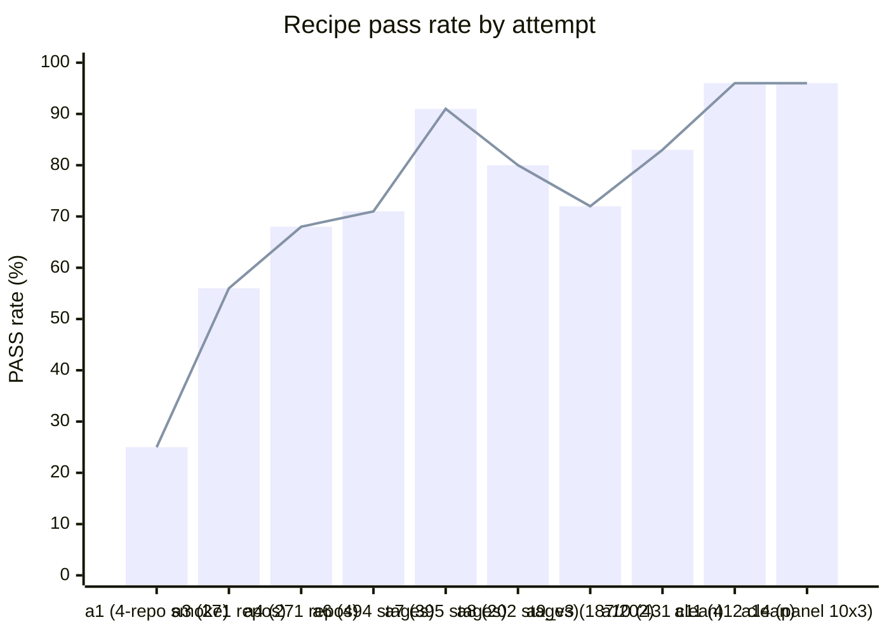

# java_8_11_17_to_java_21

Bump a Maven project **one Java LTS step** (8→11, 11→17, 17→21, 21→25) so it still compiles under the new JDK and **every test that passed before still passes** — automated by a single portable skill, leaving humans only the per-project residual.

## Usage

The deliverable is one self-contained skill — **`current_attempt/.agents/skills/bump-java-version/SKILL.md`** — a standard-tools-only hand manual (JDKs, Maven, and OpenRewrite recipes from Maven Central; **no project-specific scripts**). It isn't executed; it's **read and followed** by a coding agent.

**Done (PASS) =** `mvn compile` succeeds under `jv_to` **and** the pre-pass test set ⊆ the post-pass test set — no previously-passing test is lost. Stage facts (repo, sha, `jv_from`, `jv_to`, workdir) are passed in by the caller, never baked into the skill, so it stays portable.

### With one coding agent

Point any tool-using coding agent (Claude Code, opencode, kilocode, openhands, …) at the skill, give it the repo and the hop:

```
Bump this Maven project from Java <from> to Java <to> by following
SKILL.md. Read it first, then carry out its steps yourself.
```

The agent reads the manual and does the bump by hand: record the baseline under the old JDK → make Lombok safe → run the OpenRewrite migration → apply the deterministic JDK-removal pom edits → compile + test under the new JDK and conserve every previously-passing test → consult the troubleshooting table on failure, or bail with a reason.

### With the three-agent panel

The repo ships a harness that runs the **same** Qwen-27B headless through three unrelated off-the-shelf agents — `opencode`, `kilocode`, `openhands` — on the **identical** skill, the agent being the only variable:

```bash
# one repo, one agent
current_attempt/portability/agent_drive_one.sh <repo> <sha> <from> <to> <slug> <agent>

# a whole dataset across all three agents
OC_KEY=… python3 current_attempt/portability/agent_sweep.py <opencode|kilocode|openhands> <N>
```

Each run clones the repo, copies the skill in read-only as `.bump-skill/`, lets the agent bump it, then scores test conservation under `jv_to`. A stage PASSes only when the previously-passing tests all survive. Three stranger agents agreeing on one skill makes portability inherent; any cross-agent disagreement pinpoints the instruction to tighten. Latest panel: **96 % (26/27)** on the 8→11 / 11→17 set, and **6/6** on a first 21→25 smoke.

## How this project was built — with AI

This skill wasn't written by hand. An AI agent (Claude) **evolved** it across the attempts below against a corpus of real GitHub repos, via a reflective loop: draft the skill → run it through the three-agent panel → read where the agents fail or disagree → tighten the manual → keep the change only if it doesn't regress the corpus. The full method — ten interlocking *Problems* (P1–P10: the skill, the per-repo escalation panel, the dataset sampler, and the substrate that runs it) — is specified in **[`AGENTS.md`](AGENTS.md)**; the attempt-by-attempt trajectory with per-repo results lives under **`attempt_*/`**. The baseline each repo is measured against is the one-shot `org.openrewrite.java.migrate.UpgradeToJava<jv_to>` recipe — what an unsuspecting maintainer would do.

<details>
<summary><b>Pass rate by attempt</b> — the trajectory</summary>



One row per attempt present under `attempt_*/` (dataset/infra attempts have no recipe sweep, so a description stands in for a %):

| attempt | what changed | corpus | result |
|---|---|---|---|
| 1 | rich one-shot seed recipe chain (Jakarta + SpringBoot 3 + Hibernate 6 + JUnit5 + Java 21) | 4-repo smoke | 25 % (1/4); first attempt |
| 2 | dataset rediscovery — bootstrap the repo corpus | — | infra; no recipe iteration |
| 3 | dataset scale-up; one-shot baseline measured | 271 repos | 56 % baseline |
| 4 | staged-per-JDK (`UpgradeToJava<N>` + SB3 + Hibernate + Jakarta each stage) | 271 repos | 68 % (+12 pp) |
| 5 | lineage dataset v4 — commit-history baselines | — | dataset attempt; no recipe sweep |
| 6 | per-target `recipe.yaml` with `if_pom_contains` framework gating | ~494 stages | 71 % (+3 pp) |
| 7 | per-repo iterative search over a sequenced chain + Qwen mutations; rewrite-maven-plugin 6.12→6.40 | 395 J21 stages | **91 %** (+24 pp over iter-0) |
| 8 | per-repo search + WSCA recipe + library entries + COMPAT_MATRIX gating | 202 stages | **80 %** (162/202) |
| 9_v3 | attempt 8 + extended observation library + 4 custom recipes | 202 (187) | 72 % (135/187) — regression; enriching past a point hurts |
| 10 | drop the chain — a paste-into-any-agent prompt driven by an agent runtime (OpenHands + Qwen) | 477 (431 clean) | 75.1 % raw · 83.1 % clean · ≈96.5 % hardened (`attempt_10/README.md`) |
| 11 | repackage as the `bump-java-version` **skill** (SKILL.md + scripts + recipe catalog); non-root `mvn` | 412 clean | **95.6 %** clean (394/412) · 96.4 % w/ rung-1 (`attempt_11/README.md`) |
| 12 | rung-1 diagnosis of the union-failure set + deterministic compat floors (surefire 2.22.2, Mockito 2.23.4) folded into the skill | hardening | sha-pinned sampler era; no standalone sweep |
| 13 | unified 3-agent panel harness (one image) + agent-permission fix (skill copied into workdir) + standard-tools manual | 10 sha-pinned × 3 agents | **90 %** panel (9/10); first valid cross-agent panel |
| 14 | **manual-only skill** — one self-contained `SKILL.md`, no bundled scripts, fixes documented as pom edits | 10 sha-pinned × 3 agents | **96 %** panel (26/27): opencode 8/9, kilo 9/9, openhands 9/9 |

Numbers track P2's reward against the one-shot baseline on the same corpus; corpus composition changed across attempts, so a PASS rate is comparable within a row's column, not across rows. The largest *measured deterministic* recipe is attempt 8's sequenced chain (`attempt_7/tools/run_sequenced_java.py::plan_for()`); attempt 14's manual-only skill is the current deliverable. Deeper per-attempt detail: each `attempt_*/README.md`.
</details>

<details>
<summary><b>Repo layout</b> &amp; infrastructure</summary>

```
AGENTS.md                          the ten Problems (P1–P10) — read this first
current_attempt/
  .agents/skills/bump-java-version/
    SKILL.md                       the deliverable — one standard-tools hand manual
  portability/
    agent_drive_one.sh             unified per-repo driver (agent = only variable)
    agent_sweep.py                 run a dataset across one agent (panel = 3 sweeps)
    oh_run.py                      OpenHands SDK adapter
    Dockerfile*                    the 3-agent + JDK 8/11/17/21/25 image chain
  tools/sample_shas.py             per-round randomized-baseline sampler (P4)
  dataset-repos.json               repo names (the pool)
  dataset-shas.json                per-round sampled baselines {repo, sha, jv_from, jv_to}
attempt_1 … attempt_14/            frozen snapshots — the attempt-by-attempt trajectory
```

Substrate (per `AGENTS.md` P5–P10): a local Nexus proxy for Maven resolution (P5); a multi-JDK Docker image, scratch discipline, log rotation (P6); Qwen-27B served via vLLM behind a credentialed gateway (P7); the agent runtime with conversation + event-stream + context-management (P8); host saturation kept in band (P9); continuous capture digested by a compacting model (P10).
</details>

## How to recreate this README

This README is self-reproducible. Hand the following prompt to a Claude agent with read access to this repo and SSH alias `mh` (project work host); it should write `README.md` to match this file (within the wiggle of empirical numbers that may have updated). After running it, dispatch a separate subagent to verify reproducibility — see the prompt body.

```
You are extending a Java LTS migration project. The repo root is on a remote host
reachable via SSH alias `mh` at `$HOME/java_8_11_17_to_java_21`. Write a fresh
`README.md` at the repo root, USAGE-FIRST, with these sections in order:

1. Title + a one-paragraph purpose: bump a Maven project one Java LTS step
   (8→11, 11→17, 17→21, 21→25), conserving every previously-passing test.
2. ## Usage — the prominent hero section. State that the deliverable is one
   self-contained skill `current_attempt/.agents/skills/bump-java-version/SKILL.md`
   (a standard-tools-only hand manual — JDKs, Maven, OpenRewrite from Maven
   Central; no scripts) that an agent READS and follows, and give the PASS
   criterion (mvn compile under jv_to AND pre-pass tests ⊆ post-pass tests). Two
   subsections with concrete commands: "With one coding agent" (point any agent at
   SKILL.md; show the one-line instruction; list the steps it performs) and "With
   the three-agent panel" (the same Qwen run headless through opencode/kilocode/
   openhands on the identical skill via
   `current_attempt/portability/agent_drive_one.sh` and `agent_sweep.py`; show the
   commands and the latest panel result).
3. ## How this project was built — with AI — SMALL. A few sentences: the skill was
   evolved by an AI agent (Claude) across the attempts via a reflective loop
   (draft → run through the 3-agent panel → read failures/disagreement → tighten →
   keep only non-regressing changes); point to `AGENTS.md` for the full method (ten
   Problems P1–P10) and `attempt_*/` for the trajectory; name the one-shot
   `UpgradeToJava<jv_to>` baseline. Put the detail inside collapsible <details>
   blocks: (a) "Pass rate by attempt" — a mermaid chart plus a table with ONE ROW
   PER ATTEMPT present under `attempt_*/`, none omitted, each row naming the attempt
   and its result (count `attempt_N/per_repo_iter/*/trajectory.json` with
   `jq -r .final_verdict` for live numbers; attempts without a corpus sweep get a
   description, never an invented %); and (b) "Repo layout & infrastructure" — a
   terse tree of `current_attempt/` (the skill, the panel harness
   `agent_drive_one.sh`/`agent_sweep.py`/`oh_run.py`, the dataset files) and the
   frozen `attempt_N/` snapshots, plus one line of substrate per AGENTS.md P5–P10.
4. ## How to recreate this README — include THIS very prompt verbatim inside a
   fenced code block, prefaced by the note that any agent can regenerate the README
   by running it.

CRITICAL: after writing the file, dispatch a SEPARATE general-purpose subagent
(the Agent tool, not yourself) with this same prompt plus: "after writing your
README, diff it against the existing `README.md` at the repo root and report any
structural divergence (missing/extra sections, mis-ordered content, table rows or
commands that differ). PASS-rate numbers and live counts MAY drift between runs —
note drift but do not flag it as divergence."

Reply to the user only with a short summary: confirm the README was written, say
where, and report the subagent's verification verdict.

Constraints:
- Sentence case in headings.
- Usage is the hero; the build-with-AI/trajectory content stays small — collapsible
  <details> or references to AGENTS.md and attempt_*/.
- No prose justifications next to rules (per P1 in AGENTS.md).
- Numbers come from the artifacts on disk, never invented.
```
