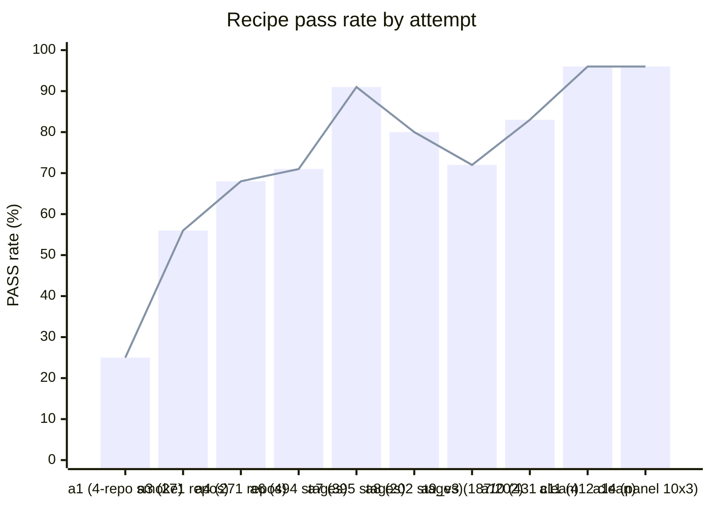

# java_8_11_17_to_java_21

Automate the universal slice of migrating Java/Maven projects one LTS step at a time (8→11, 11→17, 17→21, and now 21→25) so they still compile under the new JDK and every previously-passing test still passes — leaving humans only the per-project residual. The baseline every repo is measured against is the one-shot `org.openrewrite.java.migrate.UpgradeToJava<jv_to>` recipe.

**Using the skill.** The deliverable is a single self-contained skill, `current_attempt/.agents/skills/bump-java-version/SKILL.md` — a standard-tools-only hand manual (JDKs, Maven, and OpenRewrite recipes from Maven Central; no project-specific scripts). Point any tool-using coding agent at it: it reads the manual and performs the bump by hand — record the baseline under the old JDK, make Lombok safe, run the OpenRewrite migration, apply the deterministic JDK-removal pom edits, then compile + test under the new JDK and conserve every test that passed before. Stage facts (repo, sha, `jv_from`, `jv_to`, workdir) are injected by the consumer's harness as a prepended header, never baked into the skill, so it stays portable across agents and harnesses.

**Using it with three agents.** Production validation runs the same Qwen 27B headless through three unrelated off-the-shelf agents — `opencode`, `kilocode`, and `openhands` — on the IDENTICAL skill, via one unified harness (`current_attempt/portability/agent_drive_one.sh`, driven in bulk by `agent_sweep.py`, the agent being the only variable). Each agent clones a repo, reads the skill from a read-only `.bump-skill/` copied into its workdir, performs the bump, and the harness scores test conservation under `jv_to`; a stage PASSes only when the previously-passing tests all survive. Three stranger agents agreeing on the identical skill makes portability inherent, and any cross-agent disagreement pinpoints the instruction to tighten (see P2/P3 in `AGENTS.md`).

## Approach

The project is driven by a small set of dominantas defined in `AGENTS.md`, organized in clusters: meta (Dominanta 1), the recipe and its experimental setup (Dominanta 2–3), and the substrate that lets the recipe loop run (Dominanta 4–9). A dominanta is a self-amplifying attentional and motivational attractor — an autonomous concern that pulls the agent's attention when its trigger fires, drives action toward its single extremum, and self-amplifies until satisfied; only one dominanta is in foreground at a time (Ukhtomsky's principle).

The primary recipe dominanta (Dominanta 2) has evolved across attempts:

- **Attempts 1–7** treated the recipe as an OpenRewrite chain — a list of `(label, jdk, recipes)` steps the harness applies in sequence and validates after each step. The proposer was Qwen, the harness ran OpenRewrite primitives, and per-repo iteration mutated the chain on failure.
- **Attempts 8–9** kept the chain model but extended Qwen's primitive set with custom claude-recipes (WSCA, HttpStatusCode widening, oauth2Login scoping, security-config import for `@WebMvcTest`) and a richer observation library. Per-repo iteration ran multi-pass round-robin with K=5 attempts per stage per pass.
- **Attempt 10** drops the chain model entirely. The artifact Dominanta 2 evaluates is now a paste-into-any-coding-agent prompt (`attempt_10/prompt.md`); the agent runtime (Dominanta 7) drives the migration end-to-end using its own file / grep / shell / build tools, with a context-management primitive configured (condenser or delegated subagent) so deep stages don't lose trajectories. The harness wraps pre-test → agent → post-test → score; PASS criterion (compile clean on `jv_to` AND `pre_pass ⊆ post_pass`) lives in Dominanta 2's Contract.
- **Attempts 11–14** repackage the artifact as the portable `bump-java-version` skill and harden it across a three-agent panel. Attempt 11 ships `SKILL.md` + bundled `bump_<from>_to_<to>.sh` scripts + a versioned recipe catalog; attempts 12–13 add deterministic JDK-removal compat floors (surefire, Mockito) and a unified panel harness that runs the *same* Qwen 27B headless through three unrelated off-the-shelf agents (`opencode`, `kilocode`, `openhands`) in one image (`agent_drive_one.sh`), the agent being the only variable; **attempt 14 collapses the skill to a single self-contained `SKILL.md` hand-manual** — standard tools only (JDKs, Maven, and OpenRewrite recipes from Maven Central), no bundled scripts — that the agent reads and executes step by step. The deterministic fixes the scripts used to guarantee now live as documented pom edits the agent applies by hand.

Per-repo trajectories persist under `attempt_N/per_repo_iter/<slug>/trajectory.json`, so the search resumes from cached state across runs and across prompt or agent-runtime changes.

The baseline every repo is measured against is the one-shot `org.openrewrite.java.migrate.UpgradeToJava<jv_to>` recipe — what an unsuspecting maintainer would do.

## Results so far



Each attempt's champion against the corpus available at the time:

| attempt | champion | corpus | PASS | Δ vs same-attempt iter-0 baseline |
|---|---|---|---|---|
| 1 | rich seed (`UpgradeJavaVersion + JakartaEE10 + UpgradeSpringFramework_6_1 + UpgradeSpringBoot_3_3 + MigrateToHibernate62 + JUnit4to5Migration + MockitoBestPractices + UpgradeToJava21 + RemoveUnusedImports`) | 4-repo smoke | 25 % (1/4 build_post; Qwen quality 4.0/5) | first attempt |
| 3 | (dataset rediscovery, no recipe iteration) | 271 repos | 56 % baseline | — |
| 4 | staged-per-JDK (`UpgradeToJava<N>` + SB3 + Hibernate + Jakarta at each stage) | 271 repos | 68 % | +12 pp |
| 6 | per-target `recipe.yaml` with `if_pom_contains` framework gating | ~494 stages | 71 % | +3 pp over iter-0 |
| 7 | per-repo iterative search over a sequenced default chain (`lombok_bump → java8→11 → plugins17 → build17 → java17_transforms → plugins21 → build21 → java21_transforms`) + Qwen-proposed per-repo mutations + rewrite-maven-plugin bumped 6.12.0 → 6.40.0 | 395 J21-target stages | **91 %** | **+24 pp over iter-0 baseline (67 → 91)** |
| 8 | per-repo iterative search + WSCA recipe + 4 new library entries + COMPAT\_MATRIX gating | 202 stages | **80 %** (162/202) | baseline for attempts 9 / 10 |
| 9\_v3 | attempt 8 baseline + extended observation library + 4 claude-recipes (WSCA, oauth2Login, WidenHttpStatusToHttpStatusCode, AddSecurityConfigImportForWebMvcTest) | 202 stages (187 processed) | 72 % (135/187) | **regression vs a8 — enriching library past a point hurts; Qwen overcommits without ground truth** |
| 10 | paste-into-any-coding-agent prompt (`attempt_10/prompt.md`) driven by OpenHands SDK + Qwen 3.6 27B FP8 + LLMSummarizingCondenser | 477 (431 clean) | **75.1%** raw (358/477); **83.1%** clean (358/431, after excluding 46 unmigratable junk baselines); **≈96.5%** with hardened prompt + recovery (416/431) | corpus de-noising + recovery — most "failure" was bad baselines, not migration failure (full detail: `attempt_10/README.md`) |
| 11 | artifact repackaged as the `bump_java_version` **skill** (`.agents/skills/bump_java_version/`: SKILL.md + scripts + recipes); catalog de-branded to `tech.mikhailov.bump_java_version_recipes:bump-java-version-recipes`; `mvn` wrapper runs non-root (uid 1000) | 412 clean (20 junk dropped) | **95.6%** clean (394/412) · 94.2% raw (407/432) · **96.4%** with rung-1 escalation | first apples-to-apples fresh sweep; corpus re-audited (checkout sha-correct) + slugs renamed `owner_repo_<sha>`; rung-1 (Claude+Opus) recovers 3 of 18 fails; validated on 2 datapoints × 3 rungs (all PASS); baseline before GEPA/EvoSkills (full detail: `attempt_11/README.md`) |
| 14 | manual-only `bump-java-version` skill — one self-contained `SKILL.md` (standard-tools hand manual: JDKs + Maven + OpenRewrite from Maven Central, **no bundled scripts**), driven through the P3 three-agent panel (`opencode`/`kilocode`/`openhands`, one Qwen 27B, one harness) | 10 sha-pinned stages × 3 agents (1 `NO_BASELINE` excluded) | **96 %** panel (26/27): opencode 8/9, kilocode 9/9, openhands 9/9 — the lone opencode miss (a skipped Lombok-≥1.18.30 step) passed on retry → ≈100 % | matches the script-bundled panel (90 %) with scripts removed and no regression (snapshot: `attempt_14/`) |

Numbers track Dominanta 2's reward against the one-shot baseline on the same corpus. Caveat: corpus composition changed across attempts, so absolute PASS rate is comparable within an attempt's column but not across rows.

**Corpus state beyond the measured 202.** Dominanta 3 (dataset rediscovery) found 76 additional candidate stages during attempt 9 — 17 lineage candidates + 59 claude-recipe pattern-positives across 50 unique repos. After full yearback probing (initial pass at distances 20/50/100/200, then retry at 5/10 for history_too_short rejects, then retry at `jv_from=11` for compile_failed rejects), the net new yield is **3 verified stages** (`ankurkumar2002/AppVerse-V1.0.0`, `rslakra/SpringSecurity`, `TiagoAlb12/TQS_112901`) bringing Dominanta 3's verified pool to 6. The other 73 candidates failed mostly on `history_too_short` (young/student repos with shallow git history) or `compile_failed` under common Java versions. Attempt 10's ready-to-measure universe is therefore **193 stages** (187 + 6). The lesson for Dominanta 3: claude-recipe-pattern-positive *discovery* picks up many small/recent repos, but yearback-*verification* against the test-conservation bar filters them out — so the discovery count overstates the gain.

## Current winner recipe

The current best-known **measured** recipe is attempt 8's deterministic chain (162/202 = 80 % on the 202-stage corpus), per (jv_from, jv_to=21):

```
lombok_safe_bump               run under JDK jv_from
  - UpgradeDependencyVersion(org.projectlombok:lombok = 1.18.30)
  - ChangePropertyValue for { lombok.version, org.projectlombok.lombok.version,
    lombok-version, lombokVersion, version.lombok } = 1.18.30
java8_to_java11                run under JDK 11           # only when jv_from = 8
  - org.openrewrite.java.migrate.Java8toJava11
upgrade_plugins_for_java17     run under JDK 11           # when jv_from <= 11
  - org.openrewrite.java.migrate.UpgradePluginsForJava17
upgrade_build_to_java17        run under JDK 17
  - org.openrewrite.java.migrate.UpgradeBuildToJava17
java17_transforms              run under JDK 17           # 16 source transforms
  - InstanceOfPatternMatch, AddSerialAnnotationToSerialVersionUID,
    RemovedRuntimeTraceMethods, RemovedToolProviderConstructor, ...
upgrade_plugins_for_java21     run under JDK 17
  - org.openrewrite.java.migrate.UpgradePluginsForJava21
upgrade_build_to_java21        run under JDK 21
  - org.openrewrite.java.migrate.UpgradeBuildToJava21
java21_transforms              run under JDK 21           # 8 source transforms
  - RemoveIllegalSemicolons, ThreadStopUnsupported, URLConstructorToURICreate,
    SequencedCollection, UseLocaleOf, ReplaceDeprecatedRuntimeExecMethods,
    DeleteDeprecatedFinalize, RemovedSubjectMethods
```

The exact recipe lists and JDK assignments live in `attempt_7/tools/run_sequenced_java.py::plan_for()`; attempt 8 inherits the same chain plus claude-recipes wired in via `fold_into:sb3`.

**Attempt 10's experimental artifact** (not yet a measured winner) is the prompt at `attempt_10/prompt.md`. The harness at `attempt_10/tools/oh_drive.py` runs the prompt through an OpenHands SDK agent (Qwen 3.6 27B FP8 backend, AWQ-served condenser, event sink to `/var/log/observe/openhands.jsonl`). The agent drives the migration directly — picking recipes, applying them, fixing pre-recipe pom edits, building, iterating — rather than emitting a chain for the harness to apply.

## Resulting skill

The deliverable is a single, self-contained skill: `current_attempt/.agents/skills/bump-java-version/SKILL.md` (frozen snapshot under `attempt_14/`). It is a **standard-tools-only hand manual** — JDKs, Maven, and OpenRewrite recipes pulled from Maven Central — with **no bundled scripts**; any tool-using coding agent reads it and performs each numbered step itself (baseline → Lombok-safe → OpenRewrite migration → deterministic pom edits → compile + test + conserve → optional Spring Boot upgrade → troubleshooting table → bail).

**Contract (PASS criterion).** A stage PASSes iff `mvn compile` succeeds under `jv_to` **and** the pre-pass test set ⊆ the post-pass test set (no previously-passing test is lost). Stage facts (repo, sha, `jv_from`, `jv_to`, workdir) are injected by the consumer's harness as a prepended header, never baked into the skill, so it stays portable across agents and harnesses.

**Validation.** Driven headless by three unrelated off-the-shelf agents (`opencode`, `kilocode`, `openhands`) on the same Qwen 3.6 27B FP8 through one unified harness (`current_attempt/portability/agent_drive_one.sh`, one image, agent = only variable), the manual-only skill reaches **96 % panel PASS (26/27 scored)** on a 10-repo sha-pinned subset — opencode 89 %, kilocode 100 %, openhands 100 %. The single opencode miss was a skipped manual step (bump Lombok to ≥ 1.18.30) that passed on rerun, so removing the bundled scripts cost no pass rate versus the prior script-bundled panel.

## Repo layout

```
AGENTS.md                       dominanta contracts (read this first)
README.md                       this file
attempt_1/                      iter-0..7 trajectory + RESULTS.md
attempt_2/                      dataset rediscovery
attempt_3/                      dataset scale-up to 271 baselines
attempt_4/                      staged-migration baseline + REPORT.md
attempt_5/                      lineage dataset v4
attempt_6/                      Dominanta 2 + Dominanta 5 composer + executor, iter-0..2 results
attempt_7/                      sequenced runner + per-repo iterator
  COMPAT_MATRIX.md              SB <-> JDK <-> Hibernate compatibility table
  per_repo_iter/<slug>/         trajectory.json per repo (attempt 7 era)
  sequenced_java/<slug>.json    default-chain A/B results
  telemetry/                    Dominanta 9 raw + digest streams
  tools/
    run_sequenced_java.py       sequenced-chain executor + plan_for()
    iterate_repo.py             per-repo iterator + Qwen proposer
    round_robin.py              multi-pass corpus scheduler
    test_conservation.py        Dominanta 2 pre/post mvn-test scoring (criterion in Dominanta 2 Contract)
    compactor.py                Dominanta 9 single-window observability compactor
    compactor_multiwindow.py    Dominanta 9 multi-window digest (10s/60s/10m/60m)
    observation_library.py      pattern -> diagnosis -> fix_snippet library
attempt_8/                      claude-recipes + WSCA + 162/202 = 80 % baseline
  claude-recipes/               custom AST-aware OpenRewrite recipes
  per_repo_iter/<slug>/         attempt 8 trajectories (162 PASS)
attempt_9/                      extended library + COMPAT_MATRIX (regression vs a8)
  per_repo_iter/<slug>/         attempt 9 v3 trajectories (135 PASS / 187 processed)
attempt_10/                     agent-runtime attempt (OpenHands + Qwen)
  README.md                     attempt 10 thesis + what is inherited + what is owed
  prompt.md                     the paste-into-any-coding-agent prompt (Dominanta 2 artifact)
  investigator_findings/        7 seed findings from manual one-at-a-time runs
  per_repo_iter/<slug>/         end-to-end driver trajectories (in flight)
  tools/
    oh_event_sink.py            Conversation callback -> /var/log/observe/openhands.jsonl
    oh_one_live.py              single-stage investigator harness (read-only)
    oh_drive.py                 end-to-end driver: pre-test + agent + post-test + score
```

## Infrastructure

- Maven artifact resolution goes through a local Nexus proxy with plural upstream mirrors (Dominanta 4).
- All build toolchains and recipe execution run in a `j21-fitness:latest` Docker image with JDK 8 / 11 / 17 / 21 side-by-side (Dominanta 5).
- Qwen 3.6 27B FP8 served via vLLM at `inference.mikhailov.tech` (Dominanta 6); Qwen 3.6 27B AWQ on a separate accelerator backs the Dominanta 9 compactor and the agent's context-summarizing condenser. Both endpoints under credentialed reverse proxy.
- Agent runtime (currently OpenHands SDK) stood up with conversation lifecycle, event-stream emission, and context-management primitive configured per Dominanta 7.
- Verifier host kept in a healthy CPU utilisation band via worker-count tuning (Dominanta 8).
- System streams (host metrics, docker, app logs, agent runtime events) captured by Vector and digested by the multi-window compactor every 60 s (Dominanta 9).

## How to recreate this README

This README is self-reproducible. Hand the following prompt to a Claude agent with read access to this repo and SSH alias `mh` (project work host); the agent should write `README.md` byte-identical to this file (within the wiggle of empirical numbers that may have updated). After running the prompt, dispatch a separate subagent to verify reproducibility — see the prompt body for instructions.

```
You are extending a Java-21 migration project. The repo root is on a remote host
reachable via SSH alias `mh` at `$HOME/java_8_11_17_to_java_21`. Write a fresh
`README.md` at the repo root with these sections, in this order:

1. Title + an extended opening (a few short paragraphs): the purpose, then **how
   to use the project and the `bump-java-version` skill** — point any tool-using
   coding agent at `SKILL.md` and it performs the bump by hand — and **how to run
   it with the three-agent panel** (`opencode`/`kilocode`/`openhands` on the
   identical skill via `agent_drive_one.sh` / `agent_sweep.py`).
2. Approach: name AGENTS.md's Problem cluster structure (meta = P1; recipe and
   its experimental setup = P2–P4; substrate = P5–P10). AGENTS.md numbers its ten
   concerns `Problem (Pn)`; note that a problem is a self-amplifying attractor —
   one autonomous concern with a single Reward and trigger, only one in foreground
   at a time per Ukhtomsky's principle. Then summarise how the recipe (P2) has
   evolved across attempts: an OpenRewrite chain the harness applied for attempts
   1–9; a paste-into-any-agent prompt + agent runtime for attempt 10; repackaged as
   the portable `bump-java-version` skill for attempt 11; and, by attempt 14, a
   single self-contained `SKILL.md` hand manual (standard tools only — JDKs, Maven,
   OpenRewrite from Maven Central; no bundled scripts) the agent follows by hand,
   hardened by P3 across a three-agent panel (`opencode`/`kilocode`/`openhands`, the
   same Qwen, one harness). Per-repo trajectories persist under
   `attempt_N/per_repo_iter/<slug>/trajectory.json` and the baseline is the
   one-shot `UpgradeToJava<jv_to>` recipe.
3. Results so far: a table of champion PASS rates covering EVERY attempt present
   under `attempt_*/` directories (one row per attempt, none omitted — each row
   describes that attempt and its result) (count `attempt_N/per_repo_iter/*/trajectory.json`
   with `jq -r .final_verdict` for live numbers). For attempts 1–6 pull from
   that attempt's README.md / RESULTS.md / REPORT.md / recipes.yml. For attempts
   7–9 compute PASS rate from trajectory.json files. For the agent-driven attempts
   (10+) report the three-agent panel PASS rate, or architectural-validation
   status if a corpus sweep is mid-flight.
4. Current winner recipe / resulting skill: the largest measured deterministic
   chain (attempt 8's sequenced `(label, jdk, recipes)` rows from
   `attempt_7/tools/run_sequenced_java.py::plan_for()`) for historical context,
   then the current deliverable — the manual-only `bump-java-version` skill
   (`current_attempt/.agents/skills/bump-java-version/SKILL.md`): one self-contained
   hand manual, no scripts, with its contract (PASS = `mvn compile` under `jv_to`
   AND pre-pass tests ⊆ post-pass tests) and the three-agent panel that validates
   it (`current_attempt/portability/agent_drive_one.sh`).
5. Repo layout: terse tree of the attempts and the per-attempt tool layout.
   Mention the skill (`current_attempt/.agents/skills/bump-java-version/SKILL.md`),
   the unified three-agent panel harness
   (`current_attempt/portability/agent_drive_one.sh`, `agent_sweep.py`, `oh_run.py`),
   the per-round dataset (`current_attempt/dataset-shas.json` + `dataset-repos.json`),
   and the frozen `attempt_N/` snapshots.
6. Infrastructure: one line each for the substrate problems (P5 proxy dependency
   resolution, P6 local environment, P7 vLLM spin-up, P8 agent runtime spin-up,
   P9 runner saturation, P10 compact observations) — read AGENTS.md P5–P10 for the
   canonical wording.
7. "How to recreate this README": include THIS very prompt verbatim inside a
   fenced code block, prefaced by the note that any agent can regenerate the
   README by running it.

CRITICAL: after writing the file, dispatch a SEPARATE general-purpose subagent
(the Agent tool, not yourself) and give it this same prompt with the
additional instruction: "after writing your README, diff your output against
the existing `README.md` at the repo root; report any structural divergence
(missing/extra sections, mis-ordered content, formulae or recipe lists that
differ) so we can confirm the README is reproducible from this prompt alone.
PASS rate numbers and live counts ARE allowed to drift between runs because
the search is still progressing — note any drift but do not flag it as
divergence."

Reply to the user only with a short summary: confirm the README was written,
say where, and report the subagent's verification verdict.

Constraints:
- Sentence case in headings.
- No prose justifications next to rules (per P1 in AGENTS.md).
- Numbers come from the artifacts on disk, never invented.
```
