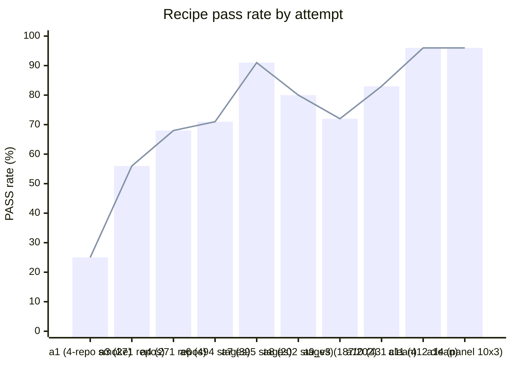

# bump_java_version

Bump a Maven project **one Java LTS step** (8→11, 11→17, 17→21, 21→25) so it still compiles under the new JDK and **every test that passed before still passes** — automated by a single portable skill, leaving humans only the per-project residual.

## Usage

The deliverable is one self-contained skill — **`current_attempt/.agents/skills/bump-java-version/SKILL.md`** — a standard-tools-only hand manual (JDKs, Maven, and OpenRewrite recipes from Maven Central; **no project-specific scripts**). It isn't executed; it's **read and followed** by a coding agent.

**Done (PASS) =** `mvn compile` succeeds under `jv_to` **and** the pre-pass test set ⊆ the post-pass test set — no previously-passing test is lost. Stage facts (repo, sha, `jv_from`, `jv_to`, workdir) are passed in by the caller, never baked into the skill, so it stays portable.

### Install in Claude Code

The skill is published as a Claude Code plugin. Install it from its marketplace repo, [`vasiliy-mikhailov/bump-java-version-skill`](https://github.com/vasiliy-mikhailov/bump-java-version-skill):

```
/plugin marketplace add vasiliy-mikhailov/bump-java-version-skill
/plugin install bump-java-version
```

It then triggers automatically when you ask Claude to upgrade or bump a Maven project's Java version. For any other agent, copy `SKILL.md` in (see below).

### With one coding agent

Point any tool-using coding agent (Claude Code, opencode, kilocode, openhands, …) at the skill, give it the repo and the hop:

```
Bump this Maven project from Java <from> to Java <to> by following
SKILL.md. Read it first, then carry out its steps yourself.
```

The agent reads the manual and does the bump by hand: record the baseline under the old JDK → make Lombok safe → run the OpenRewrite migration → apply the deterministic JDK-removal pom edits → compile + test under the new JDK and conserve every previously-passing test → consult the troubleshooting table on failure, or bail with a reason.

### With the three-agent panel

The repo ships a harness that runs the **same** Qwen-27B headless through three unrelated off-the-shelf agents — `opencode`, `kilocode`, `openhands` — on the **identical** skill, the agent being the only variable:

```bash
# one repo, one agent
current_attempt/portability/agent_drive_one.sh <repo> <sha> <from> <to> <slug> <agent>

# a whole dataset across all three agents
OC_KEY=… python3 current_attempt/portability/agent_sweep.py <opencode|kilocode|openhands> <N>
```

Each run clones the repo, copies the skill in read-only as `.bump-skill/`, lets the agent bump it, then scores test conservation under `jv_to`. A stage PASSes only when the previously-passing tests all survive. Three stranger agents agreeing on one skill makes portability inherent; any cross-agent disagreement pinpoints the instruction to tighten. Latest panel: **96 % (26/27)** on the 8→11 / 11→17 set, and **6/6** on a first 21→25 smoke.

<details>
<summary><b>The skill</b> — the full <code>SKILL.md</code> hand manual</summary>

````markdown
---
name: bump-java-version
description: Migrate a Maven project from one Java LTS to the next (8->11, 11->17, 17->21, 21->25) so it still compiles under the new JDK and previously-passing tests still pass — by hand, using only standard tools (JDKs, Maven, and OpenRewrite recipes from Maven Central; no project-specific scripts). Use when upgrading or bumping the Java version of a Maven project, modernizing to a newer JDK or LTS, or performing the Spring Boot 1->2 / 2->3 and javax->jakarta migration that a Java upgrade requires.
---

# Bumping a Maven project one Java LTS step — by hand

Migrate a Maven project **one** Java LTS step (8→11, 11→17, 17→21, or 21→25) so it **compiles** under the
new JDK and every test that **passed before still passes**. Uses only standard tools — **JDKs,
Maven, and OpenRewrite** (recipes pulled from Maven Central). No project-specific scripts.

---

## 0. Tools you need (all standard)

- The **two JDKs** — the one the project builds with now (`jv_from`) and the target (`jv_to`).
  e.g. for 8→11 you need JDK 8 **and** JDK 11. Select per command with `JAVA_HOME`.
- **Maven** (`mvn`, or the project's `./mvnw`).
- **Internet** — OpenRewrite recipes and any new deps come from Maven Central.
- **git** — commit a baseline first so you can `diff`/revert.

Do **one** step at a time (8→17 = do 8→11 fully green, then 11→17).

Versions used below are known-good; newer point releases are fine:
- rewrite-maven-plugin `6.40.0`, `rewrite-migrate-java` `3.35.0`, `rewrite-spring` `6.31.0`.
- For the **21→25** hop use `rewrite-maven-plugin` `6.41.0` + `rewrite-migrate-java` `3.36.0` — these carry the Java-25 recipes (`UpgradeBuildToJava25`, `UpgradePluginsForJava25`).

---

## 1. Record the baseline (OLD JDK)

```bash
git add -A && git commit -m baseline
JAVA_HOME=<jdk_from> mvn -B -ntp test
```
Read every `**/target/surefire-reports/TEST-*.xml`; the tests with **0 failures/errors** are your
**baseline-pass set** — the contract to conserve. Tests already failing in the baseline (no Docker,
no DB, no network) are **not** your responsibility.

---

## 2. Make Lombok safe (if the project uses Lombok)

Lombok **< 1.18.30** crashes `javac` 17/21 (`NoSuchFieldError: JCTree$JCImport.qualid`). Edit the
pom: set the Lombok version (or the `lombok.version` property) to **1.18.30** or newer. Do this
**before** any step under the new JDK.

---

## 3. Run the OpenRewrite migration

These are the **official** OpenRewrite "migrate to Java N" recipes from
`org.openrewrite.recipe:rewrite-migrate-java`. Invoke the plugin directly (no pom changes needed):

**8 → 11** — one recipe:
```bash
JAVA_HOME=<jdk_to> mvn -B -ntp -U -Denforcer.skip=true \
  org.openrewrite.maven:rewrite-maven-plugin:6.40.0:run \
  -Drewrite.activeRecipes=org.openrewrite.java.migrate.Java8toJava11 \
  -Drewrite.recipeArtifactCoordinates=org.openrewrite.recipe:rewrite-migrate-java:3.35.0
```

**11 → 17** — run these **in order** (same command shape, swap the recipe):
1. `org.openrewrite.java.migrate.UpgradePluginsForJava17`
2. `org.openrewrite.java.migrate.UpgradeBuildToJava17`

**17 → 21** — in order:
1. `org.openrewrite.java.migrate.UpgradePluginsForJava21`
2. `org.openrewrite.java.migrate.UpgradeBuildToJava21`

**21 → 25** — in order. This hop needs the newer artifacts (`rewrite-maven-plugin:6.41.0` +
`rewrite-migrate-java:3.36.0`), which ship the Java-25 recipes; run with **JDK 25** as `<jdk_to>`:
1. `org.openrewrite.java.migrate.UpgradePluginsForJava25`
2. `org.openrewrite.java.migrate.UpgradeBuildToJava25`

```bash
JAVA_HOME=<jdk_to> mvn -B -ntp -U -Denforcer.skip=true \
  org.openrewrite.maven:rewrite-maven-plugin:6.41.0:run \
  -Drewrite.activeRecipes=org.openrewrite.java.migrate.UpgradeBuildToJava25 \
  -Drewrite.recipeArtifactCoordinates=org.openrewrite.recipe:rewrite-migrate-java:3.36.0
```

> **If the OpenRewrite step itself fails to compile** (it type-attributes by compiling, e.g.
> `package javax.xml.bind does not exist`): either apply the **EE-deps fix from §4 first**, or run
> the recipe under the **OLD** JDK (`JAVA_HOME=<jdk_from>`), where the project still compiles — then
> continue. (Projects with `<annotationProcessorPaths>` — MapStruct/JHipster — see Troubleshooting.)

Review the diff (`git diff`) before continuing; commit it.

---

## 4. Apply the deterministic JDK-removal fixes (plain pom edits)

The migration recipe doesn't cover everything the JDK removed. Apply these **proactively** for the
relevant hop (symptoms/extra cases in Troubleshooting):

**For 8→11 (and 11→17 if still javax-era)** — re-add the Java-EE modules removed in JDK 11, into a
real top-level `<dependencies>`:
```xml
<dependency><groupId>javax.xml.bind</groupId><artifactId>jaxb-api</artifactId><version>2.3.1</version></dependency>
<dependency><groupId>org.glassfish.jaxb</groupId><artifactId>jaxb-runtime</artifactId><version>2.3.1</version><scope>runtime</scope></dependency>
<dependency><groupId>com.sun.activation</groupId><artifactId>javax.activation</artifactId><version>1.2.0</version><scope>runtime</scope></dependency>
<dependency><groupId>javax.annotation</groupId><artifactId>javax.annotation-api</artifactId><version>1.3.2</version></dependency>
<dependency><groupId>javax.xml.ws</groupId><artifactId>jaxws-api</artifactId><version>2.3.1</version></dependency>
```
And if the effective `maven-surefire-plugin` is **≤ 2.21** (old Spring Boot parents pin it), floor it:
set `<maven-surefire-plugin.version>2.22.2</maven-surefire-plugin.version>` in `<properties>` — it
NPEs under JDK 9+ otherwise.

**For 11→17, 17→21, and 21→25** — the test fork needs strong-encapsulation opened. Add to the
`maven-surefire-plugin` `<configuration>` an `<argLine>` with:
```
--add-opens java.base/java.lang=ALL-UNNAMED --add-opens java.base/java.lang.reflect=ALL-UNNAMED
--add-opens java.base/java.util=ALL-UNNAMED --add-opens java.base/java.text=ALL-UNNAMED
--add-opens java.base/java.io=ALL-UNNAMED --add-opens java.base/java.nio=ALL-UNNAMED
--add-opens java.base/java.time=ALL-UNNAMED --add-opens java.base/sun.nio.ch=ALL-UNNAMED
--add-opens java.desktop/java.awt.font=ALL-UNNAMED --add-opens java.management/java.lang.management=ALL-UNNAMED
```
(preserve any existing `<argLine>`, e.g. JaCoCo's `@{argLine}`). And if JaCoCo is pinned at an old
version, bump `jacoco-maven-plugin` to **0.8.12** (JDK 17/21) — or **0.8.13+** for JDK 25; older ASM can't read class-file major 61/65/69.

---

## 5. Compile + test under the NEW JDK, conserve

```bash
JAVA_HOME=<jdk_to> mvn -B -ntp -DskipTests compile      # must succeed
JAVA_HOME=<jdk_to> mvn -B -ntp test                     # baseline-pass set must still pass
```
On any failure: find the first real `[ERROR]`, apply the matching fix below, `git commit`, re-run the
**failed** step. **Done when** it compiles under `jv_to` AND baseline-pass ⊆ post-pass.

---

## 6. Spring Boot upgrades (only when the failure points there)

These are full upgrades — do them only if Troubleshooting sends you here, then re-run §3–§5. Same
command shape as §3, recipe artifact `org.openrewrite.recipe:rewrite-spring:6.31.0`:

**Spring Boot 1.x → 2.7** (1.x can't run on JDK 11) — run under the OLD JDK:
```bash
JAVA_HOME=<jdk_from> mvn -B -ntp -U -Denforcer.skip=true \
  org.openrewrite.maven:rewrite-maven-plugin:6.40.0:run \
  -Drewrite.activeRecipes=org.openrewrite.java.spring.boot2.UpgradeSpringBoot_2_7 \
  -Drewrite.recipeArtifactCoordinates=org.openrewrite.recipe:rewrite-spring:6.31.0
```

**Spring Boot 2.x → 3.3** (SB2 BOM too old for JDK 21 / ASM, or Spring Security 6 needed):
same command with `-Drewrite.activeRecipes=org.openrewrite.java.spring.boot3.UpgradeSpringBoot_3_3`.
This also performs the javax→jakarta and Spring Security 6 migrations.

---

## 7. Troubleshooting (match the first real `[ERROR]`)

| Symptom | Cause | Fix |
|---|---|---|
| `package javax.xml.bind… does not exist`, `XmlTransient`, `JAXBException`, `javax/annotation/Generated` | EE modules removed in JDK 11 | The §4 EE deps. **If during annotation processing** (`<annotationProcessorPaths>` present): regular deps aren't on the processor path — add `jaxb-api` + `javax.annotation-api` as `<path>` entries inside `<annotationProcessorPaths>` too. |
| `maven-surefire-plugin:2.20/2.21 … NullPointerException` | surefire ≤ 2.21 broken on JDK 9+ | Force surefire **2.22.2+** (pom version, or `<maven-surefire-plugin.version>2.22.2</…>` if BOM-pinned). |
| `Cannot define class using reflection` / `sun.misc.Unsafe.defineClass` / `MockitoException` (often then `OutOfMemoryError`) | old Mockito's shaded ByteBuddy uses removed `sun.misc.Unsafe` | Bump **Mockito** (not byte-buddy — it's shaded). Add **before** any BOM import in `<dependencyManagement>`: `org.mockito:mockito-core:2.23.4` + `org.objenesis:objenesis:3.2`. (Match the newest patch if the tests use the Mockito 3/4/5 API.) |
| `ASM ClassReader failed to parse` / `Unsupported class file major version 61/65/69` | ByteBuddy/ASM too old for JDK 17/21/25 | Light: dM `net.bytebuddy:byte-buddy(:agent):1.14.12` (JDK 17/21; use the newest 2025+ release for JDK 25). If it's Spring's component-scan ASM (Spring 5.2.x / SB 2.0–2.1): do the **SB 2→3** upgrade (§6) instead. |
| `ArrayIndexOutOfBoundsException: Index 1 out of bounds for length 1` from a `<clinit>` (Jadira; Hibernate Validator 5.x → "Failed to load ApplicationContext") | old lib parses `java.version`/`java.specification.version` as legacy `1.x` | Don't pass `-Djava.version=<major>` (let the JVM report its real version). If it's Hibernate Validator 5.x, bump it (`hibernate-validator` 6.2.5.Final). |
| `Error injecting JarArchiver` / `ExceptionInInitializerError at JarArchiver.<init>` | old `maven-jar/war/assembly` plexus-archiver predates JDK 11 | Bump the plugin (`maven-jar-plugin ≥ 3.4.1`) or dM `org.codehaus.plexus:plexus-archiver:4.2.7`. |
| `com.sun:tools:jar` not found / `tools.jar` systemPath | `tools.jar` removed in JDK 9 | Delete the `com.sun:tools` system-scoped dependency. If code uses `com.sun.tools.javac.*`: add `--add-exports jdk.compiler/com.sun.tools.javac.*=ALL-UNNAMED` to `maven-compiler-plugin` `<compilerArgs>` **and** surefire `<argLine>`, and use `<source>/<target>` (NOT `<release>`). |
| `no Bean Validation provider could be found` | provider dropped | Add `org.hibernate.validator:hibernate-validator` (6.2.5.Final javax / 8.0.1.Final jakarta). |
| `OutOfMemoryError` during tests (JHipster etc.) | **usually downstream** of a context-load failure | Fix the **first** real error first; only raise the surefire `-Xmx` if it's genuinely heap. |
| `EmbeddedServletContainerException` / `spring-context-4.x`, bean-creation failures | Spring Boot 1.x can't run on JDK 11 | Do the **SB 1→2** upgrade (§6), then re-run. *(Apps with custom SB-1.x code on SB-2-removed APIs — e.g. WebGoat — won't compile on SB2; bail.)* |
| `cannot find symbol: class WebSecurityConfigurerAdapter` | Spring Security 6 (only after going to SB3) | Do the **SB 2→3** upgrade (§6), which migrates it. |
| `jsonschema2pojo … ClassAlreadyExistsException` | stale generated classes in `target/` | `rm -rf target` (or `mvn clean`), re-run. |
| Docker/Selenium/DB test errors (`Could not find a valid Docker environment`, Testcontainers, MariaDB4j) | needs infra the box lacks — failed in baseline too | Ignore — not a regression. |
| no `pom.xml` at root | nested project | `find . -name pom.xml -not -path '*/target/*'`, `cd` into the shallowest, run steps there. |

---

## 8. When to bail (honestly)

After the migration + every matching fix, if it still won't compile or tests still regress, stop and
report the failed step + the unresolved `[ERROR]`. Known genuine bails:
- **Spring Boot 1.x app whose custom code calls SB-2-removed APIs** (`EmbeddedServletContainerFactory`,
  `actuate.endpoint.mvc`, `thymeleaf.resourceresolver`) — needs a hand-written migration.
- **JHipster-8 app whose OpenRewrite step fails with a cascade** (JAXB → `javax.annotation.Generated`
  → MapStruct/jpamodelgen NPE) — the annotation-processing stack is too old for JDK 11; the real fix
  is a JHipster/Spring-Boot version upgrade, beyond a one-LTS-step bump.
- **Source genuinely uses a removed JDK API** that no recipe can rewrite.

An honest bail with the reason beats a green build that hides a dropped test.
````

</details>

## How this project was built — with AI

This skill wasn't written by hand. An AI agent (Claude) **evolved** it across the attempts below against a corpus of real GitHub repos, via a reflective loop on a **two-rung ladder** — first Claude + Opus 4.8 (the strong rung, which separates *genuinely unfixable* from *needs a new recipe*), then the production **three-agent panel** (the same Qwen-27B through `opencode`/`kilocode`/`openhands`): draft the skill → run it down both rungs → read where it fails or the agents disagree → tighten the manual at the stronger rung so it survives the weaker → keep the change only if it doesn't regress the corpus. The full method — twelve interlocking *Problems* (P1–P12: the skill, the per-repo escalation panel, the dataset sampler, the substrate that runs it, shipping it to the public skill ecosystem, and opening bump PRs in response to live GitHub requests) — is specified in **[`AGENTS.md`](AGENTS.md)**; the attempt-by-attempt trajectory with per-repo results lives under **`attempt_*/`**. The baseline each repo is measured against is the one-shot `org.openrewrite.java.migrate.UpgradeToJava<jv_to>` recipe — what an unsuspecting maintainer would do.

<details>
<summary><b>Pass rate by attempt</b> — the trajectory</summary>



One row per attempt present under `attempt_*/` (dataset/infra attempts have no recipe sweep, so a description stands in for a %):

| attempt | what changed | corpus | result |
|---|---|---|---|
| 1 | rich one-shot seed recipe chain (Jakarta + SpringBoot 3 + Hibernate 6 + JUnit5 + Java 21) | 4-repo smoke | 25 % (1/4); first attempt |
| 2 | dataset rediscovery — bootstrap the repo corpus | — | infra; no recipe iteration |
| 3 | dataset scale-up; one-shot baseline measured | 271 repos | 56 % baseline |
| 4 | staged-per-JDK (`UpgradeToJava<N>` + SB3 + Hibernate + Jakarta each stage) | 271 repos | 68 % (+12 pp) |
| 5 | lineage dataset v4 — commit-history baselines | — | dataset attempt; no recipe sweep |
| 6 | per-target `recipe.yaml` with `if_pom_contains` framework gating | ~494 stages | 71 % (+3 pp) |
| 7 | per-repo iterative search over a sequenced chain + Qwen mutations; rewrite-maven-plugin 6.12→6.40 | 395 J21 stages | **91 %** (+24 pp over iter-0) |
| 8 | per-repo search + WSCA recipe + library entries + COMPAT_MATRIX gating | 202 stages | **80 %** (162/202) |
| 9_v3 | attempt 8 + extended observation library + 4 custom recipes | 202 (187) | 72 % (135/187) — regression; enriching past a point hurts |
| 10 | drop the chain — a paste-into-any-agent prompt driven by an agent runtime (OpenHands + Qwen) | 477 (431 clean) | 75.1 % raw · 83.1 % clean · ≈96.5 % hardened (`attempt_10/README.md`) |
| 11 | repackage as the `bump-java-version` **skill** (SKILL.md + scripts + recipe catalog); non-root `mvn` | 412 clean | **95.6 %** clean (394/412) · 96.4 % w/ rung-1 (`attempt_11/README.md`) |
| 12 | rung-1 diagnosis of the union-failure set + deterministic compat floors (surefire 2.22.2, Mockito 2.23.4) folded into the skill | hardening | sha-pinned sampler era; no standalone sweep |
| 13 | unified 3-agent panel harness (one image) + agent-permission fix (skill copied into workdir) + standard-tools manual | 10 sha-pinned × 3 agents | **90 %** panel (9/10); first valid cross-agent panel |
| 14 | **manual-only skill** — one self-contained `SKILL.md`, no bundled scripts, fixes documented as pom edits | 10 sha-pinned × 3 agents | **96 %** panel (26/27): opencode 8/9, kilo 9/9, openhands 9/9 |

Numbers track P2's reward against the one-shot baseline on the same corpus; corpus composition changed across attempts, so a PASS rate is comparable within a row's column, not across rows. The largest *measured deterministic* recipe is attempt 8's sequenced chain (`attempt_7/tools/run_sequenced_java.py::plan_for()`); attempt 14's manual-only skill is the current deliverable. Deeper per-attempt detail: each `attempt_*/README.md`.
</details>

<details>
<summary><b>Repo layout</b> &amp; infrastructure</summary>

```
AGENTS.md                          the twelve Problems (P1–P12) — read this first
current_attempt/
  .agents/skills/bump-java-version/
    SKILL.md                       the deliverable — one standard-tools hand manual
  portability/
    agent_drive_one.sh             unified per-repo driver (agent = only variable)
    agent_sweep.py                 run a dataset across one agent (panel = 3 sweeps)
    oh_run.py                      OpenHands SDK adapter
    Dockerfile*                    the 3-agent + JDK 8/11/17/21/25 image chain
  tools/sample_shas.py             per-round randomized-baseline sampler (P4)
  dataset-repos.json               repo names (the pool)
  dataset-shas.json                per-round sampled baselines {repo, sha, jv_from, jv_to}
attempt_1 … attempt_14/            frozen snapshots — the attempt-by-attempt trajectory
```

Substrate (per `AGENTS.md` P5–P10): a local Nexus proxy for Maven resolution (P5); a multi-JDK Docker image, scratch discipline, log rotation (P6); Qwen-27B served via vLLM behind a credentialed gateway (P7); the agent runtime with conversation + event-stream + context-management (P8); host saturation kept in band (P9); continuous capture digested by a compacting model (P10).
</details>

## How to recreate this README

This README is self-reproducible. Hand the following prompt to a Claude agent with read access to this repo and SSH alias `mh` (project work host); it should write `README.md` to match this file (within the wiggle of empirical numbers that may have updated). After running it, dispatch a separate subagent to verify reproducibility — see the prompt body.

```
You are extending a Java LTS migration project. The repo root is on a remote host
reachable via SSH alias `mh` at `$HOME/java_8_11_17_to_java_21`. Write a fresh
`README.md` at the repo root, USAGE-FIRST, with these sections in order:

1. Title (`bump_java_version`, the GitHub repo name; the host working directory is
   still `$HOME/java_8_11_17_to_java_21`) + a one-paragraph purpose: bump a Maven
   project one Java LTS step
   (8→11, 11→17, 17→21, 21→25), conserving every previously-passing test.
2. ## Usage — the prominent hero section. State that the deliverable is one
   self-contained skill `current_attempt/.agents/skills/bump-java-version/SKILL.md`
   (a standard-tools-only hand manual — JDKs, Maven, OpenRewrite from Maven
   Central; no scripts) that an agent READS and follows, and give the PASS
   criterion (mvn compile under jv_to AND pre-pass tests ⊆ post-pass tests). Two
   subsections with concrete commands: "With one coding agent" (point any agent at
   SKILL.md; show the one-line instruction; list the steps it performs) and "With
   the three-agent panel" (the same Qwen run headless through opencode/kilocode/
   openhands on the identical skill via
   `current_attempt/portability/agent_drive_one.sh` and `agent_sweep.py`; show the
   commands and the latest panel result). End the Usage section with a
   collapsible <details> embedding the full `SKILL.md` verbatim in a fenced code
   block (use a fence longer than the skill's own code fences), so the skill reads
   inline. Also add an "Install in Claude Code" subsection with the Claude Code
   plugin commands (the skill is published as a plugin at
   `vasiliy-mikhailov/bump-java-version-skill`).
3. ## How this project was built — with AI — SMALL. A few sentences: the skill was
   evolved by an AI agent (Claude) across the attempts via a reflective loop on a
   two-rung ladder — first Claude+Opus 4.8, then the production three-agent panel
   (opencode/kilocode/openhands on the same Qwen): draft → run it down both rungs →
   read failures/disagreement → tighten at the stronger rung so it survives the
   weaker → keep only non-regressing changes; point to `AGENTS.md` for the full method (twelve
   Problems P1–P12) and `attempt_*/` for the trajectory; name the one-shot
   `UpgradeToJava<jv_to>` baseline. Put the detail inside collapsible <details>
   blocks: (a) "Pass rate by attempt" — a mermaid chart plus a table with ONE ROW
   PER ATTEMPT present under `attempt_*/`, none omitted, each row naming the attempt
   and its result (count `attempt_N/per_repo_iter/*/trajectory.json` with
   `jq -r .final_verdict` for live numbers; attempts without a corpus sweep get a
   description, never an invented %); and (b) "Repo layout & infrastructure" — a
   terse tree of `current_attempt/` (the skill, the panel harness
   `agent_drive_one.sh`/`agent_sweep.py`/`oh_run.py`, the dataset files) and the
   frozen `attempt_N/` snapshots, plus one line of substrate per AGENTS.md P5–P10.
4. ## How to recreate this README — include THIS very prompt verbatim inside a
   fenced code block, prefaced by the note that any agent can regenerate the README
   by running it.

CRITICAL: after writing the file, dispatch a SEPARATE general-purpose subagent
(the Agent tool, not yourself) with this same prompt plus: "after writing your
README, diff it against the existing `README.md` at the repo root and report any
structural divergence (missing/extra sections, mis-ordered content, table rows or
commands that differ). PASS-rate numbers and live counts MAY drift between runs —
note drift but do not flag it as divergence."

Reply to the user only with a short summary: confirm the README was written, say
where, and report the subagent's verification verdict.

Constraints:
- Sentence case in headings.
- Usage is the hero; the build-with-AI/trajectory content stays small — collapsible
  <details> or references to AGENTS.md and attempt_*/.
- No prose justifications next to rules (per P1 in AGENTS.md).
- Numbers come from the artifacts on disk, never invented.
```
